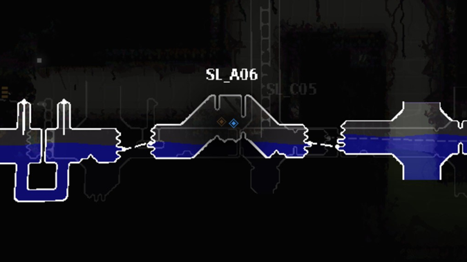

# Extended Collectibles Tracker (iotrip fix)

Where the remaining stuff at?

A fork of [FranklyGD's Extended Collectibles Tracker](https://steamcommunity.com/sharedfiles/filedetails/?id=3244633122)
with the freezes and stale markers fixed. It installs under its own mod id, so it sits
alongside the original rather than replacing it — enable only one.

## Features

- **On the map** — a marker per collectible your slugcat can get: data pearls, blue and
  gold arena tokens, red safari, green slugcat, white broadcast (Spearmaster only), each
  in its own colour.
  - **Empty and pulsing** while there's something left to do, **solid** once there isn't:
    a token when collected, a pearl when an iterator deciphers it.
  - **Unexplored rooms** get a glow instead of an exact spot. It pins to the screen edge
    when off-screen and fades with distance, so it doubles as a rough compass.
- **On the sleep screen** — one dot per pearl, for each region you've visited, after the
  vanilla unlock row.
  - **Empty** — not found, or not deciphered. **Half filled** — that pearl is in the
    shelter with you, swallowed, held or on the floor. **Filled** — deciphered.
- **On the fast travel screen** — the region's token and pearl progress at a glance.
- **Room names** — optional labels above each room the map is showing, so you can tell
  where you are without counting shapes.
- **Instant map** — optional; the map opens the moment you press the button, already
  showing everything you've explored, instead of a hold delay and a gradual reveal.
- **In Remix options** — each of the four is toggled separately: **Show Map Markers**,
  **Show Room Glow**, **Show Room Names** and **Instant Map**.

## What this fork fixes

- Hibernation and death screens freezing, with the slugcat animation still playing and no
  button responding — two separate causes, both since fixed.
- Pearl and token markers going stale until the map was rebuilt on the next hibernation.
- A pearl collecting a duplicate marker a few times a second, until the pile of them froze
  the map and the rest of the game with it.
- Markers for pearls that have no type, pointing at pearls that aren't there — a pearl can
  come back from a save string without one, and then it can't be identified at all.
- A carried pearl's marker sitting where the pearl was rather than where it is.
- The screen appearing to freeze while the map is open, with the game still running behind
  it. Vanilla's key item markers throw on an item they have no icon for, which abandons the
  rest of that frame's drawing — so "Slug Senses" and "Key Item Tracking" can stay on.

See [CHANGELOG.md](CHANGELOG.md) for the full list.

## Steam Workshop

